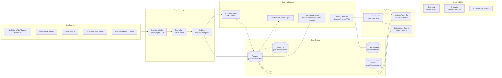
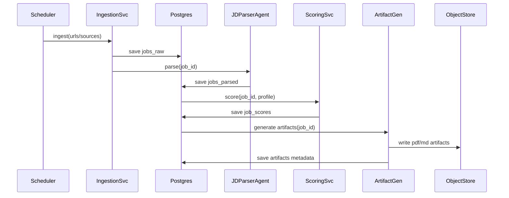
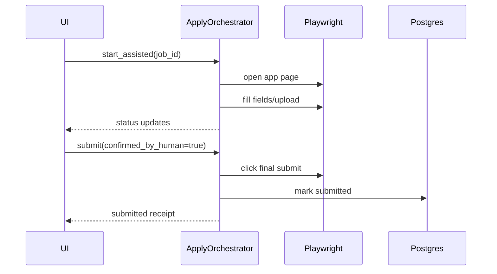

# CareerOps (JobForge/RoleLens) — Complete Design Architecture & Execution Plan

> **Purpose:** Build a human-in-the-loop job search platform that **finds**, **scores**, and **prepares** high-quality applications with optional **assisted apply** automation.
>
> **Non-goal:** Blind mass auto-apply. That behavior is how you get throttled/blacklisted and waste months.

---

## 1) What we are building (project summary)

### 1.1 Product statement
A system that:
1. Continuously ingests job postings from multiple sources
2. Normalizes + parses each job description into structured fields
3. Computes a **fit score** against your real profile + constraints (visa/location/comp/stack)
4. Generates **tailored artifacts** (resume variant, short answers, recruiter pitch)
5. Supports **assisted apply** (autofill, upload, paste) with a **human final submit**
6. Tracks outcomes and improves scoring using feedback loops

### 1.2 Who this is for
- Senior/Staff-ish engineers where **quality beats quantity**
- People who want a repeatable pipeline, not “apply to 300 jobs and pray”

### 1.3 Core outcomes
- Higher callback rate per application
- Less time wasted on bad-fit roles
- Consistent, auditable, non-hallucinated resume tailoring

---

## 2) Core principles (non-negotiable)

1. **Truth-only generation:** The system can reframe, reorder, and emphasize. It cannot invent tools, metrics, employers, degrees, or experience.
2. **Rules before LLMs:** Constraints and “hard stops” must be deterministic (visa, location, seniority mismatch, comp floor).
3. **Human gate by default:** Automation stops before final submit unless strict conditions are met.
4. **Auditability:** Every decision should be explainable: *why skip*, *why 82/100*, *what keywords missing*.
5. **Safety against spam fingerprints:** Rate limits, variability, and selective applications.

---

## 3) High-level architecture (system design)



---

## 4) Components (what you must build)

### 4.1 Ingestion Service
**Responsibility**
- Fetch job postings (HTML + metadata)
- Normalize to text
- Deduplicate
- Store to Postgres

**Tech**
- Python + Playwright (dynamic pages), plus plain HTTP for Greenhouse/Lever APIs when possible
- Queue: Redis or a lightweight broker (RQ/Celery)

**Key outputs**
- `job_raw` record stored with HTML snapshot and extracted text

---

### 4.2 JD Parser Agent (structured extraction)
**Responsibility**
- Convert messy JD text into a **strict JSON schema**:
  - role title, seniority, requirements, skills, keywords, responsibilities, red flags

**Must be deterministic**
- LLM output must validate against schema
- If it fails, retry with repair prompt; if still fails, mark as `PARSE_FAILED` and show in UI

---

### 4.3 Constraints & Rules Engine (hard gates)
**Responsibility**
- Reject jobs that violate hard constraints BEFORE scoring
- Example: requires US citizenship, or onsite only, or salary below floor

**Important**
- This is not LLM territory. Use rules.

---

### 4.4 Fit Scoring Service (ranking)
**Responsibility**
- Score 0–100 with breakdown + rationale + confidence
- Combine:
  - Rule-based matching (must-have coverage)
  - Embedding similarity (role + responsibilities)
  - LLM rationale (why this is a fit / gaps)

**Output**
- `fit_score.total`
- `fit_score.breakdown`
- `verdict`: `SKIP`, `ASSISTED_APPLY`, `ELIGIBLE_AUTO_SUBMIT`

---

### 4.5 Artifact Generator (resume + answers)
**Responsibility**
- Choose best resume base (v1/v2/…)
- Tailor bullets without inventing facts
- Generate:
  - tailored resume
  - recruiter pitch
  - screening answers (when required)

**Guardrails**
- Use a **bullet library** (approved statements only)
- Always track which bullets were used + rewritten

---

### 4.6 Apply Orchestrator (assisted apply)
**Responsibility**
- Drive Playwright to:
  - open application page
  - fill forms
  - upload tailored resume
  - paste short answers
  - stop at final submit (default)

**Auto-submit policy**
Only if:
- score >= 85
- platform = Greenhouse/Lever
- no custom questions OR only standard fields
- you have applied to company < N times this month
- cooldown + rate limits satisfied

---

### 4.7 UI Dashboard (control center)
**Responsibility**
- List jobs in pipeline with filters: score bands, source, company, verdict
- Per job view:
  - parsed JD
  - score breakdown
  - generated artifacts
  - apply button (assisted) + manual notes
  - outcome tracking

---

## 5) Data model (Postgres tables)

### 5.1 `jobs_raw`
| column | type | notes |
|---|---|---|
| job_id | uuid | PK |
| source | text | linkedin/greenhouse/lever/company |
| source_url | text | unique |
| company | text | normalized |
| title | text | |
| location | text | |
| posted_at | timestamptz | if available |
| html_snapshot_path | text | in object storage |
| text_content | text | normalized |
| content_hash | text | for dedupe |
| ingest_status | text | INGESTED/DUPLICATE/FAILED |
| created_at | timestamptz | |

### 5.2 `jobs_parsed`
| column | type | notes |
|---|---|---|
| job_id | uuid | FK |
| parsed_json | jsonb | schema-validated |
| parser_version | text | prompt/version |
| parse_status | text | PARSED/PARSE_FAILED |
| created_at | timestamptz | |

### 5.3 `job_scores`
| column | type | notes |
|---|---|---|
| job_id | uuid | FK |
| total_score | int | 0-100 |
| breakdown | jsonb | weights + subscores |
| verdict | text | SKIP/ASSISTED/AUTO |
| rationale | text | short explanation |
| scoring_version | text | |
| created_at | timestamptz | |

### 5.4 `artifacts`
| column | type | notes |
|---|---|---|
| artifact_id | uuid | PK |
| job_id | uuid | FK |
| type | text | resume/answers/pitch |
| path | text | object storage |
| metadata | jsonb | bullet IDs, keyword coverage |
| created_at | timestamptz | |

### 5.5 `applications`
| column | type | notes |
|---|---|---|
| application_id | uuid | PK |
| job_id | uuid | FK |
| apply_mode | text | manual/assisted/auto |
| status | text | started/submitted/failed |
| submitted_at | timestamptz | |
| notes | text | |
| created_at | timestamptz | |

### 5.6 `outcomes`
| column | type | notes |
|---|---|---|
| outcome_id | uuid | PK |
| job_id | uuid | FK |
| stage | text | rejected/phone/onsite/offer |
| updated_at | timestamptz | |
| source | text | email/manual |
| details | jsonb | optional |

---

## 6) Request/Response contracts (incoming & outgoing)

Below are API-style contracts if you implement services as microservices. If monolith, keep the same interfaces internally.

### 6.1 Ingestion: Create job
**Incoming**
`POST /v1/jobs/ingest`

```json
{
  "source": "linkedin",
  "source_url": "https://....",
  "company_hint": "Blue Yonder",
  "title_hint": "GenAI Engineer",
  "location_hint": "Dallas, TX"
}
```

**Outgoing**
```json
{
  "job_id": "c2d2fbe4-1c4c-4f64-b1fd-5d4c9a4c1f1c",
  "ingest_status": "INGESTED",
  "dedupe": false
}
```

---

### 6.2 Parse JD
**Incoming**
`POST /v1/jobs/{job_id}/parse`

```json
{
  "parser_version": "jd-parser-v3"
}
```

**Outgoing**
```json
{
  "job_id": "....",
  "parse_status": "PARSED",
  "parsed_jd": {
    "role": "Senior GenAI Engineer",
    "seniority": "Senior",
    "must_have_skills": ["Python", "LLM", "RAG"],
    "nice_to_have_skills": ["Kubernetes", "Azure"],
    "responsibilities": ["..."],
    "ats_keywords": ["..."],
    "red_flags": ["Requires clearance"]
  }
}
```

---

### 6.3 Score job
**Incoming**
`POST /v1/jobs/{job_id}/score`

```json
{
  "candidate_profile_id": "primary",
  "scoring_version": "score-v2"
}
```

**Outgoing**
```json
{
  "job_id": "....",
  "total_score": 82,
  "breakdown": {
    "core_skill_match": 30,
    "genai_depth": 22,
    "domain": 10,
    "seniority": 12,
    "constraints": 8
  },
  "verdict": "ASSISTED_APPLY",
  "rationale": "Strong GenAI + Python fit; minor gap in X; comp range unknown"
}
```

---

### 6.4 Generate artifacts
**Incoming**
`POST /v1/jobs/{job_id}/artifacts/generate`

```json
{
  "resume_base_id": "resume-v2",
  "artifact_types": ["resume", "recruiter_pitch", "short_answers"]
}
```

**Outgoing**
```json
{
  "job_id": "....",
  "artifacts": [
    {
      "type": "resume",
      "path": "s3://.../resume_jobid.pdf",
      "metadata": {
        "keyword_coverage": 0.86,
        "bullet_ids": ["BY-012", "BY-044", "HF-003"]
      }
    },
    {
      "type": "recruiter_pitch",
      "path": "s3://.../pitch_jobid.md"
    }
  ]
}
```

---

### 6.5 Assisted apply session
**Incoming**
`POST /v1/jobs/{job_id}/apply/assisted/start`

```json
{
  "browser_profile": "default",
  "stop_before_submit": true
}
```

**Outgoing**
```json
{
  "session_id": "a9c1....",
  "status": "RUNNING",
  "events_stream": "/v1/apply/sessions/a9c1/events"
}
```

---

### 6.6 Apply session events (stream/poll)
**Outgoing**
```json
{
  "session_id": "a9c1....",
  "timestamp": "2026-01-24T06:10:00Z",
  "event": "FIELD_FILLED",
  "details": {"field": "email"}
}
```

---

### 6.7 Submit (manual confirmation)
**Incoming**
`POST /v1/jobs/{job_id}/apply/submit`

```json
{
  "session_id": "a9c1....",
  "confirmed_by_human": true
}
```

**Outgoing**
```json
{
  "application_id": "....",
  "status": "SUBMITTED",
  "submitted_at": "2026-01-24T06:12:00Z"
}
```

---

## 7) Schemas (strict JSON)

### 7.1 Parsed JD schema (simplified)
```json
{
  "role": "string",
  "seniority": "Intern|Junior|Mid|Senior|Staff|Principal|Unknown",
  "employment_type": "Full-time|Contract|Unknown",
  "location_type": "Remote|Hybrid|Onsite|Unknown",
  "must_have_skills": ["string"],
  "nice_to_have_skills": ["string"],
  "responsibilities": ["string"],
  "ats_keywords": ["string"],
  "red_flags": ["string"],
  "salary_range": {
    "min": "number|null",
    "max": "number|null",
    "currency": "string|null"
  }
}
```

### 7.2 Candidate profile schema (simplified)
```json
{
  "core_roles": ["string"],
  "skills": {
    "languages": ["string"],
    "frameworks": ["string"],
    "genai": ["string"],
    "infra": ["string"],
    "data": ["string"]
  },
  "constraints": {
    "visa": "string",
    "location": "string",
    "remote_only": "boolean",
    "min_base_usd": "number"
  },
  "approved_bullets": [
    {
      "id": "string",
      "text": "string",
      "tags": ["string"]
    }
  ]
}
```

---

## 8) End-to-end sequence diagrams

### 8.1 Discover → Score → Prepare


### 8.2 Assisted apply


---

## 9) Execution plan (step-by-step, practical)

### Phase 0 — Prep (Day 0–1)
1. Collect your **truth source**:
   - Base resume v1/v2
   - Bullet library (approved statements only)
   - Metrics library (numbers you can defend)
2. Define constraints:
   - Visa requirement rules
   - Remote/hybrid preferences
   - Minimum comp floor
   - Target titles and seniority

**Deliverable:** `candidate_profile.json` (validated)

---

### Phase 1 — MVP: Ingest + Parse + Score (Week 1)
1. Build `jobs_raw` ingestion (URL input)
2. Normalize JD (HTML -> clean text)
3. Deduplicate (hash + company/title normalization)
4. Implement JD Parser Agent with strict schema validation
5. Implement Rules Engine (hard rejects)
6. Implement Scoring Service with weighted breakdown
7. Build a minimal UI list view: job, score, verdict, reasons

**Deliverable:** A dashboard that produces a **ranked backlog** of jobs, not applications.

---

### Phase 2 — Artifact Generation (Week 2)
1. Create bullet library format (IDs + tags)
2. Build Resume Tailor Agent with guardrails:
   - only uses approved bullets
   - optional rewriting but must preserve claims
3. Generate:
   - tailored resume (PDF or DOCX)
   - recruiter pitch (short)
   - short answers (when asked)
4. Add keyword coverage report per job

**Deliverable:** One-click generation of job-specific artifacts.

---

### Phase 3 — Assisted Apply Automation (Week 3)
1. Build Apply Orchestrator:
   - login handling (manual)
   - form detection
   - file upload
2. “Stop before submit” default behavior
3. Persist apply session logs
4. Add UI: start assisted apply, view events, mark submitted manually

**Deliverable:** Assisted apply that saves time without spamming.

---

### Phase 4 — Feedback loop (Week 4+)
1. Track outcomes (rejected/phone/onsite/offer)
2. Correlate outcomes with score bands
3. Improve scoring weights
4. Add “company preference” rules:
   - allowlist/denylist
   - cooldown windows
5. Add A/B testing for resume variants (optional)

**Deliverable:** Your system gets smarter instead of repeating mistakes.

---

## 10) Suggested repo structure (monorepo)

```
careerops/
  apps/
    web/                    # dashboard UI
    worker/                 # ingestion + orchestration
  services/
    parser/                 # jd parsing agent
    scoring/                # scoring service
    artifacts/              # resume + answers
    apply/                  # playwright apply orchestrator
  packages/
    schemas/                # jsonschema/pydantic models
    common/                 # shared utils (logging, config)
  infra/
    docker/
    k8s/
    terraform/
  docs/
    architecture.md
```

---

## 11) Security & compliance basics (don’t ignore)
- Store resumes/artifacts encrypted at rest
- Keep browser session cookies local and protected
- Don’t scrape aggressively; respect rate limits
- Avoid violating terms where possible (prefer official endpoints like Greenhouse/Lever)
- Keep an audit log for every generation and submission

---

## 12) “Done” checklist (what must exist)
- [ ] Ingestion pipeline + dedupe
- [ ] Strict JD parsing with schema validation
- [ ] Rules engine for hard constraints
- [ ] Fit scoring with breakdown + rationale
- [ ] Artifact generation that cannot hallucinate
- [ ] Dashboard to review and trigger actions
- [ ] Assisted apply that stops before submit
- [ ] Outcome tracking + feedback loop

---

## 13) Minimal config files you’ll maintain

### 13.1 `candidate_profile.json`
- skills, roles, constraints, approved bullets

### 13.2 `scoring_weights.json`
- weights and thresholds for verdicts

### 13.3 `company_policies.yaml`
- allowlist/denylist, cooldowns, platform-specific flags

---

## 14) Final advice (ruthless but true)
If you build only one thing, build the **ranking + artifact quality**. That’s where ROI is.
If you rush to auto-submit, you’ll build a spam cannon and then wonder why callbacks died.
